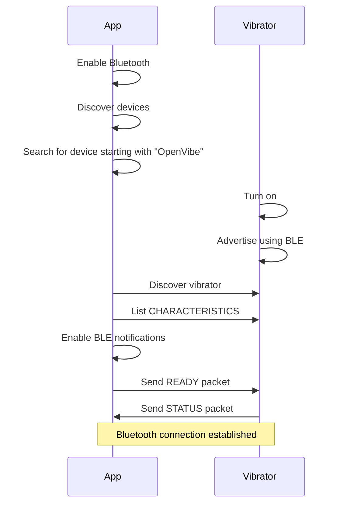
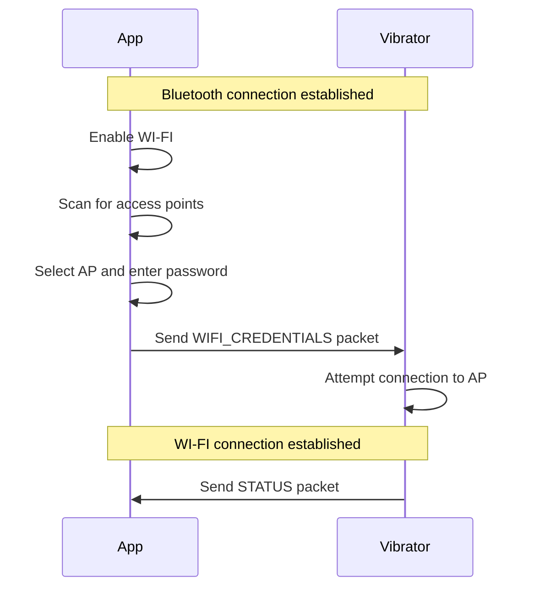
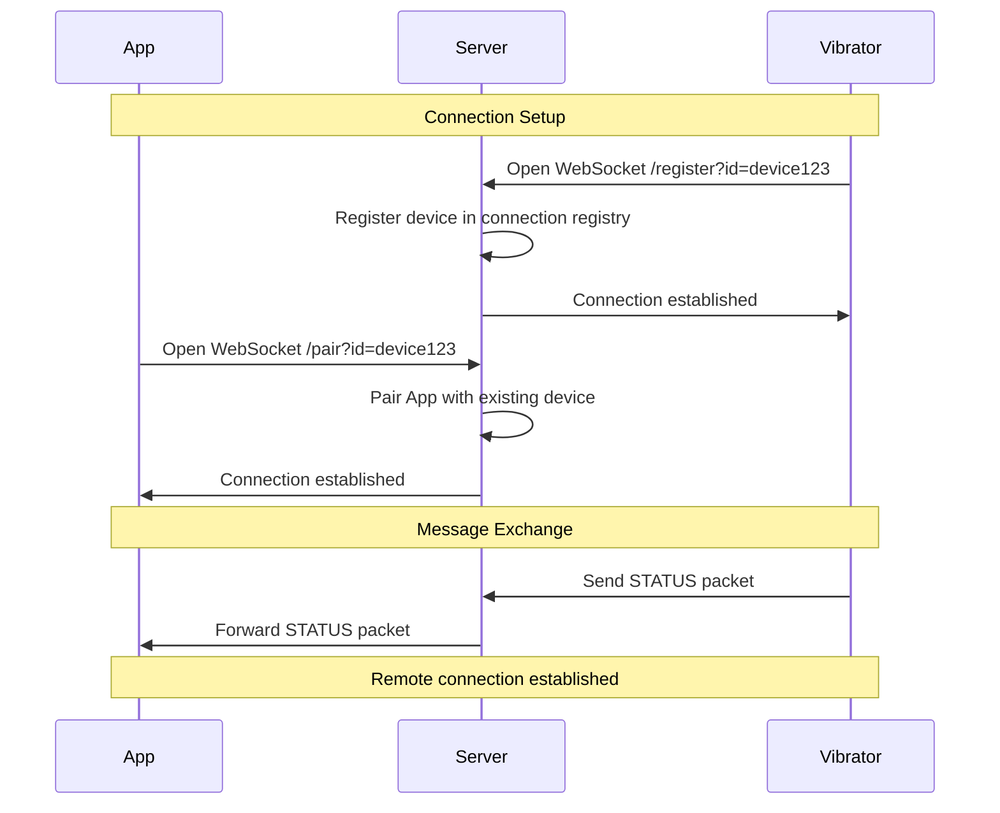

# OpenVibe Project Documentation

## Abstract

Comprehensive documentation for the OpenVibe project - a multi-platform ecosystem enabling wireless communication between the mobile app and the vibrator. This document covers project architecture, planned features, repository structure, and detailed specifications for three connection protocols:

- **BLE Connection (Proximity)**: Direct Bluetooth Low Energy connection for close-range communication when no Wi-Fi is available
- **Wi-Fi Connection (Local Network)**: Network-based connection when both devices share the same Wi-Fi access point
- **Remote Connection**: Server-mediated WebSocket connection for long-distance communication through internet relay

## Project Scope

OpenVibe is a multi-platform ecosystem enabling wireless communication between mobile applications and IoT vibrator devices. The project encompasses:

- Cross-platform mobile applications (iOS/Android)
- Embedded firmware for ESP32-based vibrator devices
- Cloud relay server infrastructure
- Protocol specifications and communication standards

## Planned Features

### Core Features
- Multi-protocol device connectivity (BLE, Wi-Fi, Remote)
- Real-time vibration pattern control
- Device discovery and pairing
- Secure authentication and encryption
- Vibration pattern customization
- Cross-platform compatibility
- Adaptive vibration (will evaluate intensity level based on user enjoyment)

## Architectural Choices

### Communication Protocols
- **BLE (Bluetooth Low Energy)**: Chosen for proximity-based connections due to low power consumption and universal mobile support
- **WebSocket**: Implemented for local and remote connections enabling real-time bidirectional communication through server relay

### Technology Stack
- **Mobile**: Cross-platform framework for iOS/Android compatibility
- **Embedded**: ESP32 microcontroller for Wi-Fi/BLE dual-mode capability
- **Backend**: WebSocket server for real-time message relay
- **Protocol**: Custom JSON based communication protocol

## Repository Structure

### Core Repositories
- **[OpenVibe-Client](https://github.com/OpenVibeProject/OpenVibe-Client)**: Cross-platform mobile application source code
- **[OpenVibe-Embedded](https://github.com/OpenVibeProject/OpenVibe-Embedded)**: ESP32 embedded firmware for vibrator devices
- **[OpenVibe-Server](https://github.com/OpenVibeProject/OpenVibe-Server)**: WebSocket relay server implementation
- **[OpenVibe-Docs](https://github.com/OpenVibeProject/OpenVibe-Docs)**: Project documentation and technical specifications

## Connection Flows

### BLE Connection (Proximity)
This mode should be used when no WI-FI access points are available and the two devices are in close proximity

### WI-FI Connection (Local Network)
This mode should be used when a WI-FI access point is available and the two devices are in the same local network

### Remote Connection
This mode should be used when the two devices are far away from each other, so they cannot connect via Bluetooth or the same WI-FI access point
